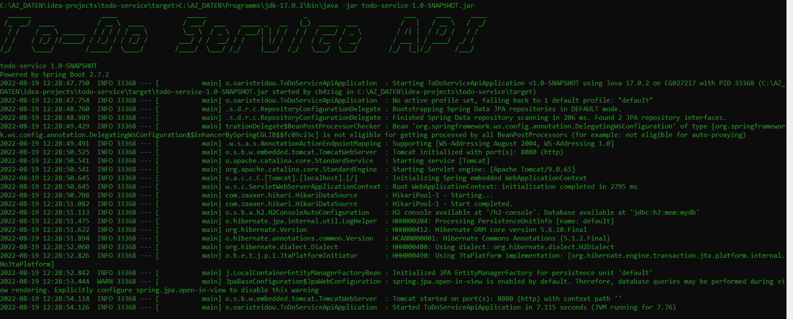
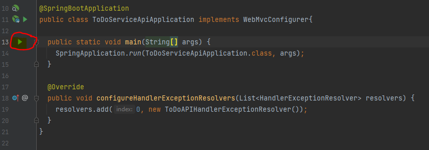

# ToDo-Service Project
This is an APi Rest Boot based Project using Java 17 Version and Spring Boot Version 2.7.

The project is using the new Java features like lambdas and stream for developing a nice clean code ToDo Service which has a basic functionality.

An H2 Database has been chosen, and it is available via the h2-console.  

As well for designing the project a yaml file has been used and the generation of the DTOs is via the OpenApiTools Package.

The project does not have any security between the application and the caller. Cause as OAuth, CIM etc and it can be access directly.

For business logic validations a special enum representation has been developed for shown all the validations in an enum.
This gives the advantage of manipulating the condition of a validation based on validation category, function category.
Additionally, a http status validation exception handler has been developed for manipulating different error scenarios.

## Index
- [ToDo-Service Project](#todo-service-project)
  - [Assumptions](#assumptions)
  - [Tech stack used](#tech-stack-used)
  - [How to build the service with docker](#how-to-build-the-service-with-docker)
  - [How to build run automation tests](#how-to-build-run-automation-tests)
  - [How to run service locally](#how-to-run-service-locally)
    - [1. Using command line](#1-using-command-line)
    - [2. Using Intellij IDEA by clicking the run button](#1-using-command-line)
  - [API Operations](#api-operations)
  - [Examples](#examples)
    - [Add item](#add-item)
    - [Update item](#update-item)
    - [Get all items](#get-all-items)
    - [Get all items with parameter status option 'not done'](#get-all-items-with-parameter-status-option-not-done)
    - [Get item by id](#get-item-by-id)
    - [Service forbids changing 'past due' items](#service-forbids-changing-past-due-items)
  - [Postmann Collection](#postmann-collection)

## Assumptions
We need to take for granted that the user would not make any penetrations or try to get the credentials of the database.
The security of the project from user inputs to the communication with the database is not implemented, 
and it would be considered maybe in the next releases :)!  

## Tech stack used
- [x] Backend: Spring based framework 5.3.22 and SpringBoot 2.7.2
- [x] App Programming Language: Java 17.0.2
- [x] Services: REST over HTTP
- [x] Database: H2 in memory database
- [x] PostmanCanary Version 9.20.0-canary
- [x] Maven 3.6.3

## How to build the service with docker

The application is dockerized and this means that the repo can be run be creating a Docker image of the project:

```bash
mvn clean package dockerfile:build

docker-compose up
```

## How to build run automation tests

```bash
mvn clean test
```

## How to run service locally
### 1. Using command line:
```bash
mvn clean package
java -jar todo-service-1.0-SNAPSHOT.jar
```


or

### 2. Using Intellij IDEA by clicking the run button in the `ToDoServiceApiApplication.class`
```bash
mvn clean compile
```



## API Operations

The following is a list of supported operations:
- Save a toDo item:`POST /v1/todo-list/items/addItem`
- Update a toDo item:`PATCH /v1/todo-list/items/updateItem`
- Get all items with a status parameter as an option:`GET /v1/todo-list/items/getAllItems`
- Get all details of an toDo item by id:`GET /v1/todo-list/items/getAllDetailsById/{id}`

## Examples

### Add item
**URL:** `/v1/todo-list/items/addItem`

**Method:** `POST`

**Auth required:** No.

**Data constraints:**

```json
{
  "description": "Go shopping",
  "status": "not done",
  "dueDate": "2022-10-28T00:00:01Z"
}
```

**Expected Response**
```json
{
"itemId": 1,
"description": "Go shopping",
"status": "not done",
"dueDate": "2022-10-28T00:00:01"
}
```

---
### Update item
**URL:** `/v1/todo-list/items/updateItem`

**Method:** `PATCH`

**Auth required:** No.

**Data constraints:**

```json
{
  "itemId": 2,
  "status": "done"
}
```

**Expected Response**
```json
{
  "itemId": 1,
  "status": "done",
  "doneDate": "2022-08-20T22:13:55.1818144"
}
```
---

### Get all items
**URL:** `/v1/todo-list/items/getAllItems`

**Method:** `GET`

**Auth required:** No.

**Expected Response**
```json
{
  "items": [
    {
      "itemId": 1,
      "description": "Go shopping",
      "status": "past due",
      "dueDate": "2021-10-28T00:00:01"
    },
    {
      "itemId": 2,
      "description": "Go shopping",
      "status": "done",
      "dueDate": "2022-10-28T00:00:01",
      "doneDate": "2022-08-20T22:00:51.251749"
    }
  ]
}
```

---

### Get all items with parameter status option 'not done'
**URL:** `/v1/todo-list/items/getAllItems`

**Method:** `GET`

**Parameter:** `status=not done`

**Auth required:** No.

**Expected Response**
```json
{
  "items": [
    {
      "itemId": 1,
      "description": "Go shopping 1",
      "status": "not done",
      "dueDate": "2022-10-28T00:00:01"
    },
    {
      "itemId": 2,
      "description": "Go shopping 2",
      "status": "not done",
      "dueDate": "2022-10-28T00:00:01"
    },
    {
      "itemId": 3,
      "description": "Go shopping 3",
      "status": "not done",
      "dueDate": "2022-10-28T00:00:01"
    },
    {
      "itemId": 4,
      "description": "Go shopping 4",
      "status": "not done",
      "dueDate": "2022-10-28T00:00:01"
    }
  ]
}
```
---
### Get item by id
**URL:** `/v1/todo-list/items/getAllDetailsById/{id}`

**Method:** `GET`

**Path:** `{id}`

**Auth required:** No.

**Expected Response**
```json
{
  "itemId": 2,
  "description": "Go shopping",
  "status": "done",
  "dueDate": "2022-10-28T00:00:01",
  "doneDate": "2022-08-20T22:00:51.251749"
}
```

---
### Service forbids changing 'past due' items 
**URL:** `/v1/todo-list/items/getAllDetailsById/{id}`

**Method:** `GET`

**Path:** `{id}`

**Auth required:** No.

**Request**
```json
{
  "itemId": 5,
  "status": "done"
}
```

**Expected Response**
```json
{
  "itemId": 5,
  "status": "done",
  "notification": [
    {
      "NotificationType": "Error",
      "Text": "The status type cannot be changed to 'past due'!",
      "IdentityNumber": "01"
    }
  ]
}
```

## Postmann Collection
A Postmann collection can be found with some basic functions of the application:
- addItem
- updateItem
- getAllItems
- getAllDetailsById

[Postman Collection Link](ToDo_Service.postman_collection.json)